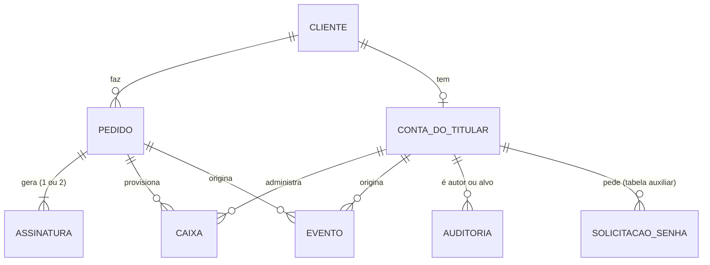
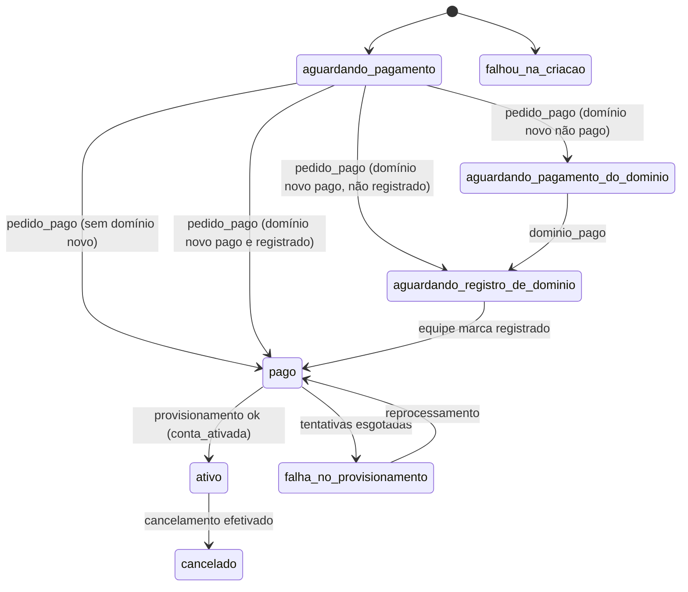
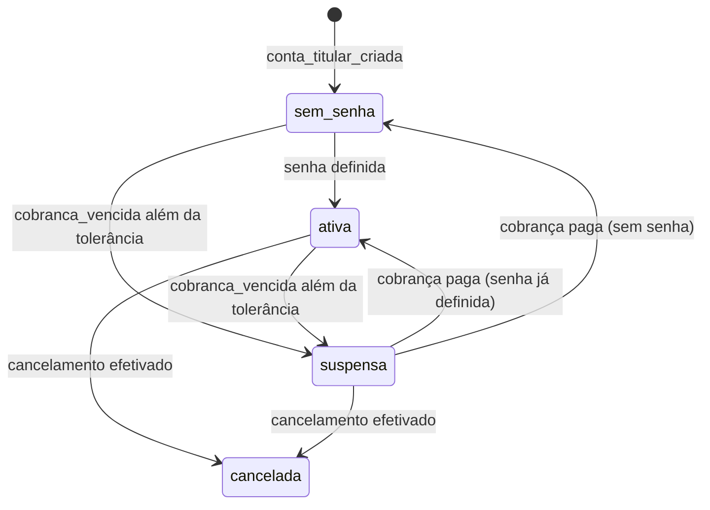

# Modelo de dados inicial

Anexo de referência dos ADRs [0004](../0004-banco-e-migracoes.md) (PostgreSQL) e [0005](../0005-fila-e-eventos-de-dominio.md) (fila e eventos). Não é uma decisão: descreve as entidades que as histórias #53 em diante vão criar.

Data: 2026-09-25

## Convenções

- Sem DDL. Tipos, índices e restrições finais ficam para a #53 (E2-H3), em migrações SQL.
- Chave primária: `id` UUID gerado pelo servidor, salvo onde indicado. Nunca exposto como único segredo de acesso (a página de status usa token próprio).
- Toda tabela tem `criado_em` e, se muda, `atualizado_em` (UTC).
- Valores em centavos inteiros, como em `assets/precos.js`.
- Nenhuma senha, token ou chave em texto. Senha do titular só como hash Argon2id (ADR 0008). Senha de caixa nunca é gravada (E4-H2).
- Sessão do painel e contador de tentativas de login ficam no Redis (ADRs 0008 e 0013), não no PostgreSQL.
- "provisório (#48)": campo que depende do contrato real da API da Skymail, confirmado pela PoC (E2-H2).

## Visão geral

| Relação | Cardinalidade | Origem |
|---|---|---|
| cliente → pedido | 1 : N | E3-H2 (CPF/CNPJ reaproveitado) |
| cliente → conta do titular | 1 : 0..1 | E3-H4 (criada no pagamento) |
| pedido → assinatura | 1 : 1..2 | E3-H2 (contas; domínios em assinatura anual separada) |
| conta do titular → caixa | 1 : N | E5-H4 a E5-H7 |
| pedido → caixa | 1 : N | E4-H2 (caixas contratadas no pedido) |
| agregado → evento | 1 : N | ADR 0005 |
| ator ou alvo → auditoria | 1 : N | E6-H7 |
| conta do titular → solicitação de senha | 1 : N | E5-H2, E7-H3 (tabela auxiliar) |

## Entidade: cliente

Quem compra. Espelha o cliente do Asaas.

- **Chave:** `id`. Únicos: `documento` e `asaas_cliente_id`.
- **Atributos:** `tipo_pessoa` (física ou jurídica), `documento` (CPF ou CNPJ, validado), `nome`, `email`, `telefone`, `asaas_cliente_id`, `anonimizado_em` (E6-H3, nulo até a exclusão de dados).
- **Relações:** tem N pedidos; tem 0 ou 1 conta do titular.
- **Regras:** novo pedido com o mesmo documento reaproveita o cliente (E3-H2). Nome e telefone mudam pelo painel (E5-H9); e-mail e documento não. Dado pessoal: nunca vai para payload de evento nem para log.

## Entidade: pedido

Uma compra feita no checkout. Guarda o total calculado pelo servidor (ADR 0012).

- **Chave:** `id`. Únicos: `token_publico` (link da página de status, imprevisível, E3-H5) e `chave_idempotencia` (enviada pelo checkout, E3-H2).
- **Atributos:**
  - `cliente_id`, `estado` (ver "Estados do pedido"), `ciclo` (`mensal` ou `anual`).
  - Itens: contas por tipo (`5gb`, `25gb`, `50gb`) com quantidade, add-ons com quantidade (hoje `talk`, `backup90`, `backup365`, `grupoEmail`, `skybox` 50 GB, 100 GB ou 1 TB, conforme `assets/precos.js`; lista final provisória (#48), E3-H8), domínio principal (`existente` ou `novo`) e domínios extras. Tabela filha ou coluna JSON: decisão da #53.
  - `total_centavos`, `segmentos_desconto` (contratação, anual ou volume) e `versao_tabela_precos` (ADR 0012).
  - Aceite: `aceite_em`, `versao_termos`, `versao_privacidade`, `ip_aceite` (E6-H2).
  - Domínios: cada domínio do pedido (principal e extras) é um item com `id` UUID próprio (o `dominioItemId` dos eventos), `nome`, `tipo` (`existente` ou `novo`) e `verificado_em` (E4-H3). Domínio não é entidade própria nem agregado de evento: eventos de domínio usam o pedido como agregado. Pode virar entidade depois da #48.
  - Domínio novo: `dominio_pago_em` (1º pagamento da assinatura de domínios) e `dominio_registrado_em` (equipe marca o registro, E4-H4).
  - `falha_motivo` (código, sem dado pessoal) quando o estado for de falha.
- **Relações:** pertence a 1 cliente; gera 1 ou 2 assinaturas; provisiona N caixas; origina N eventos.

## Entidade: assinatura

Recorrência no Asaas. Um pedido tem a assinatura das contas e, se houver domínio novo ou extra, uma assinatura anual só dos domínios (E3-H2).

- **Chave:** `id`. Único: `asaas_assinatura_id`.
- **Atributos:** `pedido_id`, `cliente_id`, `tipo` (`contas` ou `dominios`), `ciclo`, `valor_centavos` (atualizado por E3-H6), `estado` (`ativa`, `cancelamento_solicitado`, `cancelada`), `url_primeira_fatura`.
- **Cancelamento (E5-H10):** `cancelamento_protocolo` (único), `cancelamento_motivo`, `cancelamento_solicitado_em`, `encerra_em` (fim do ciclo pago), `cancelada_em`, `reembolso_centavos` (E3-H7, pos-mvp).
- **Relações:** pertence a 1 pedido e a 1 cliente.
- **Regras:** faturas não são gravadas aqui; o painel as lê do Asaas (E5-H8). Só uma solicitação de cancelamento aberta por conta (E5-H10).

## Entidade: conta do titular

Login do painel. Nasce sem senha no pagamento (E3-H4).

- **Chave:** `id`. Únicos: `cliente_id` e `email` (login).
- **Atributos:** `cliente_id`, `email` (do pedido), `senha_hash` (Argon2id; nulo em `sem_senha`), `senha_definida_em`, `estado` (ver "Estados da conta do titular"), `suspensa_em`, `motivo_suspensao` (`inadimplencia`).
- **Solicitações de senha:** tabela auxiliar própria, abaixo.
- **Relações:** pertence a 1 cliente; administra N caixas; tem N solicitações de senha; aparece na auditoria como autor ou alvo.

### Tabela auxiliar: solicitação de definição de senha

Decidido: tabela própria, não colunas na conta. Guarda cada pedido de link de senha (E5-H2) e dá o `solicitacaoId` do evento `definicao_senha_solicitada`.

- **Chave:** `id` UUID (é o `solicitacaoId`).
- **Atributos:** `conta_titular_id`, `tipo` (`primeiro_acesso` ou `redefinicao`), `token_hash` (nulo até o envio), `expira_em`, `enviada_em`, `usada_em`.
- **Regras:** E5-H2 cria a linha e publica o evento só com o `solicitacaoId`. O job de e-mail (E7-H3) gera o token no envio e grava só o hash; um reenvio gera token novo e troca o hash. Usar o link grava `usada_em` e invalida as demais solicitações abertas da conta. Token nunca em texto, nem no evento, nem na fila.

## Entidade: caixa

Caixa de e-mail criada na Skymail.

- **Chave:** `id`. Único: `endereco`.
- **Atributos:**
  - `conta_titular_id`, `pedido_id` (nulo se criada pelo painel, E5-H5), `endereco`, `tamanho` (`5gb`, `25gb`, `50gb`), `estado` (`provisionando`, `ativa`, `suspensa`, `excluida`), `excluida_em`.
  - `skymail_caixa_id`: provisório (#48).
  - `skymail_dominio_id`: provisório (#48).
  - `cota_mb` como a Skymail a representa: provisório (#48).
  - `sincronizada_em` (última lista conhecida, E5-H4): provisório (#48).
- **Relações:** pertence a 1 conta do titular; vem de 0 ou 1 pedido.
- **Regras:** senha nunca gravada (E4-H2, E5-H7). Mínimo de 2 caixas de 5 GB se o tipo existir; última caixa não é excluída (E5-H6).

## Entidade: evento

Evento de domínio gravado na mesma transação da mudança de estado e publicado depois na fila (outbox, ADR 0005). Lista de eventos no anexo [eventos-de-dominio.md](eventos-de-dominio.md).

- **Chave:** `id` (é o `eventoId` do payload). Único: `chave_idempotencia`.
- **Atributos:** `nome`, `versao`, `agregado_tipo` (`pedido`, `conta_titular` ou `assinatura`), `agregado_id`, `payload` (JSON só com ids e dados não pessoais), `request_id` (correlação, ADR 0013), `ocorrido_em`, `publicado_em` (nulo até ir para a fila), `tentativas_publicacao`.
- **Relações:** pertence a 1 agregado (pedido, conta do titular ou assinatura).
- **Regras:** a restrição única em `chave_idempotencia` impede o mesmo fato duas vezes; formato da chave no anexo de eventos. O webhook bruto do Asaas (E3-H4) e o log de chamadas à Skymail (E4-H1) ficam em tabelas próprias, fora deste anexo. O webhook bruto é único pelo id do evento do Asaas, guarda só campos sem dado pessoal e tem retenção proposta de 90 dias (ADR 0005, a confirmar).

## Entidade: auditoria

Trilha das ações críticas (E6-H7, ADR 0013). Tabela só de inclusão: o usuário da aplicação tem só `INSERT` e `SELECT`.

- **Chave:** `id` sequencial (ordem de gravação).
- **Atributos:** `ocorrido_em`, `autor_tipo` (`cliente`, `sistema`, `equipe`), `autor_id`, `acao` (login, falha de login, bloqueio, criação ou exclusão de caixa, troca de senha, alteração cadastral, cancelamento, exclusão de dados, suspensão, reativação), `alvo_tipo`, `alvo_id`, `ip`, `resultado` (`sucesso` ou `falha`), `request_id`, `detalhes` (JSON sem senha nem token).
- **Relações:** referencia conta do titular, caixa, cliente ou pedido por `alvo_tipo` + `alvo_id`, sem chave estrangeira (o registro sobrevive à anonimização).
- **Retenção (proposta, a confirmar):** `ip` em claro por 6 meses, depois pseudonimizado ou apagado; registro por 5 anos (ADR 0013). A exclusão de dados (E6-H3) não apaga a auditoria.
- **Ação a mais:** registro manual de domínio pela equipe (E4-H4).

## Estados do pedido

| Estado | Entra quando | História |
|---|---|---|
| `aguardando_pagamento` | pedido e assinaturas criados no Asaas | E3-H2 |
| `falhou_na_criacao` | erro do Asaas ao criar cliente ou assinatura | E3-H2 |
| `aguardando_pagamento_do_dominio` | contas pagas, domínio novo ainda sem pagamento; nada é provisionado | E3-H4, E3-H5 |
| `aguardando_registro_de_dominio` | contas e domínio novo pagos, domínio ainda não registrado; tarefa manual aberta | E4-H4 |
| `pago` | tudo pago (e domínio novo registrado, se houver); provisionamento na fila (a página mostra "ativando") | E3-H4, E3-H5, E4-H4 |
| `ativo` | provisionamento concluído (`conta_ativada`) | E4-H2 |
| `falha_no_provisionamento` | tentativas do job esgotadas; alerta à equipe | E4-H2 |
| `cancelado` | cancelamento efetivado no fim do ciclo pago (equipe no mvp; E3-H7 no pos-mvp) | E5-H10, E3-H7 |

Transições:

- `aguardando_pagamento` → próximo estado: só uma vez por pedido, mesmo com webhook repetido (E3-H4). Chave `pedido_pago-<pedidoId>`.
- **Domínio novo:** nada é provisionado antes do pagamento das contas, e o provisionamento espera o domínio pago e registrado.
  - `dominio_pago` com o pedido ainda `aguardando_pagamento`: grava `dominio_pago_em` e abre a tarefa de registro (E4-H4), sem mudar o estado. Se a equipe marcar o registro nesse intervalo, grava `dominio_registrado_em` e não enfileira nada.
  - `pedido_pago` depois: vai direto ao estado que os dois campos indicam (tabela do diagrama).
  - `dominio_pago` com o pedido `aguardando_pagamento_do_dominio`: vai a `aguardando_registro_de_dominio` e abre a tarefa.
  - Equipe marca o registro com o pedido `aguardando_registro_de_dominio`: vai a `pago` e o job de E4-H2 é enfileirado (E4-H4).
- `pago` → `ativo`: pelo job de E4-H2; emite `conta_ativada`.
- `pago` → `falha_no_provisionamento` → `pago`: o reprocessamento (E2-H10) retoma de onde parou.
- `ativo` → `cancelado`: a solicitação (E5-H10) não muda o estado; só a efetivação.
- Em aberto (README, "Decisões em aberto"): expiração de pedido `aguardando_pagamento` nunca pago; se `falhou_na_criacao` permite nova tentativa com a mesma chave de idempotência, e o que fazer com assinatura órfã no Asaas.

## Estados da conta do titular

| Estado | Significado | História |
|---|---|---|
| `sem_senha` | criada no pagamento, aguarda o link de primeiro acesso | E3-H4, E5-H2 |
| `ativa` | senha definida; painel liberado | E5-H2, E4-H5 |
| `suspensa` | caixas suspensas por inadimplência; painel mostra aviso e fatura | E4-H5 |
| `cancelada` | cancelamento efetivado | E5-H10, E3-H7 |

Transições:

- Suspensão e reativação publicam `conta_suspensa` e `conta_reativada` e vão para a auditoria (E4-H5, E6-H7).
- A reativação volta ao estado anterior à suspensão: `ativa` se a senha já foi definida, senão `sem_senha`.
- Redefinição de senha não muda o estado; revoga as sessões (ADR 0008).
- Bloqueio por tentativas (E6-H4) não é estado da conta: é temporário e fica no Redis (ADR 0013).

## Revisões

| Data | Revisão | Origem |
|---|---|---|
| 2026-09-25 | Criação do anexo. | CIT-47 |
| 2026-09-25 | Ajustes da revisão: estados do pedido com domínio novo, tabela de solicitação de senha, itens de domínio com id, `agregado_tipo` sem `dominio`, retenções. | CIT-47 |
| a definir | Revisão prevista pela #48 (PoC Skymail): campos da caixa marcados "provisório (#48)", lista de add-ons do pedido. | #48 |
